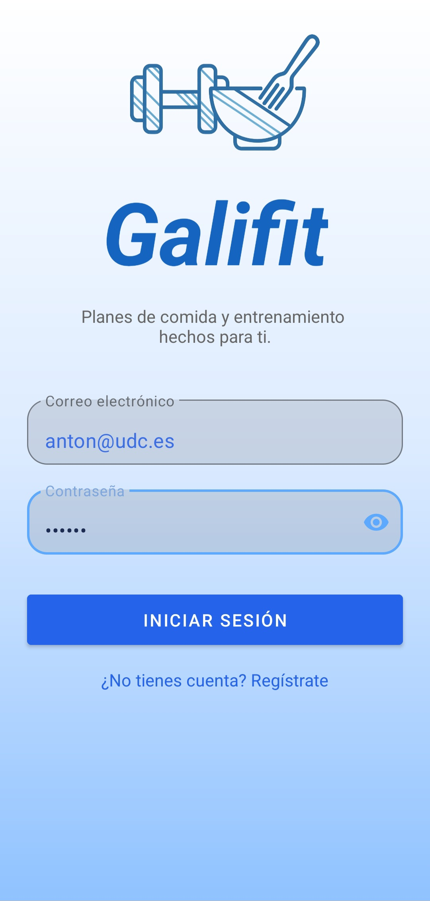
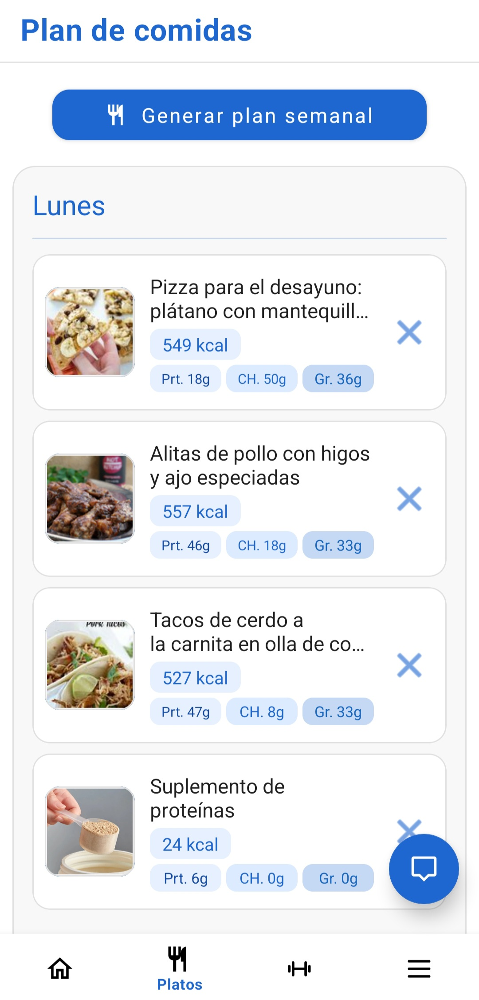
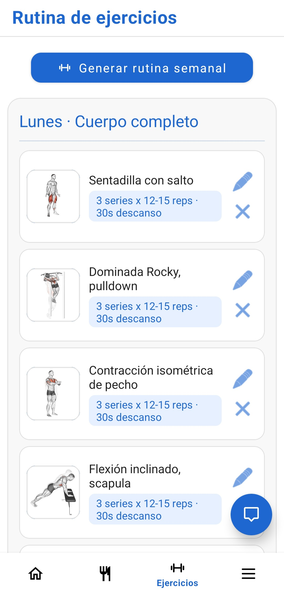
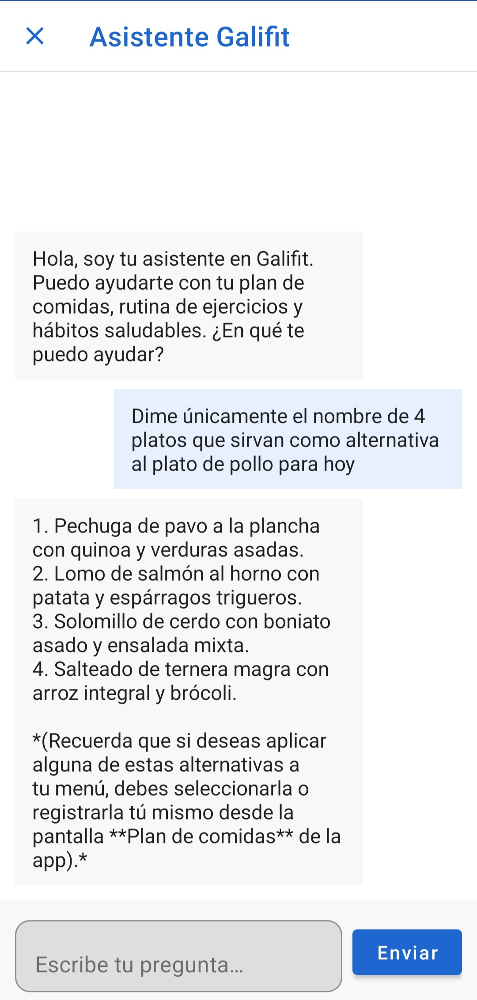

# Galifit

Aplicación Android desarrollada como Trabajo Fin de Máster (TFM) del Máster Universitario en Ingeniería Informática (MUEI). Galifit ayuda a cualquier persona a cuidar su alimentación y su actividad física generando **planes personalizados de comidas y de ejercicio** a partir de sus datos y preferencias, sin necesidad de conocimientos previos de nutrición o entrenamiento.

A diferencia de otras aplicaciones del sector, que se centran solo en la nutrición o solo en el ejercicio y reservan las funciones útiles a una suscripción de pago, Galifit integra ambos ámbitos de forma gratuita y los adapta al perfil de cada usuario (objetivo, nivel de actividad, restricciones alimentarias, equipamiento disponible, etc.). El perfil se recoge una sola vez mediante un cuestionario inicial (*onboarding*) y puede modificarse en cualquier momento.

La aplicación se apoya en servicios en la nube para autenticación y persistencia (Firebase), en catálogos de recetas y ejercicios de terceros (Edamam y ExerciseDB/Wger) y en inteligencia artificial generativa (Gemini) para el asistente conversacional y el análisis de imágenes de comida.

## Funcionalidades

La aplicación ofrece, entre otras, las siguientes funcionalidades:

* **Cuestionario inicial (*onboarding*).** Un asistente por pasos que recoge los datos y preferencias del usuario (objetivo, nivel de actividad, restricciones alimentarias, equipamiento…) para construir sus planes personalizados. Estos datos pueden revisarse y editarse después desde la pantalla de preferencias.
* **Plan de comidas.** Menús semanales personalizados con sus recetas, valores nutricionales y detalle de cada plato. El usuario puede consultar la elaboración de cada receta y crear sus propios platos.
* **Plan de ejercicio.** Rutinas de entrenamiento adaptadas al objetivo, nivel y equipamiento del usuario, con la posibilidad de crear ejercicios propios.
* **Lista de la compra.** Generación automática de la lista de ingredientes a partir del plan de comidas.
* **Análisis de imágenes de comida.** A partir de una fotografía, la aplicación estima el plato y su información nutricional apoyándose en IA generativa.
* **Asistente conversacional.** Un chat que resuelve dudas sobre nutrición, ejercicio y uso de la aplicación teniendo en cuenta el contexto del usuario.
* **Avisos de sedentarismo.** Notificaciones que animan al usuario a moverse tras periodos prolongados de inactividad.

## Capturas

A continuación se muestran algunas pantallas representativas de la aplicación:

### Acceso



### Plan de comidas



### Plan de ejercicio



### Asistente conversacional



## Instalación de la APK

En la carpeta [`APKs/`](APKs/) se incluye el fichero `GalifitTFM.apk`, correspondiente a la versión de entrega del proyecto.

Para instalarla en un dispositivo Android:

1. Copia el fichero `GalifitTFM.apk` al dispositivo (por cable, correo, almacenamiento en la nube, etc.).
2. En el dispositivo, abre el fichero desde el explorador de archivos.
3. Si es la primera vez, Android pedirá permiso para **instalar aplicaciones de orígenes desconocidos**; acéptalo para la aplicación desde la que estás abriendo el fichero (por ejemplo, el explorador de archivos o el navegador).
4. Confirma la instalación y espera a que finalice.
5. Abre Galifit desde el menú de aplicaciones.

> Se requiere un dispositivo con Android 8.0 (API 26) o superior y conexión a Internet, ya que la aplicación utiliza servicios en la nube para generar y almacenar los planes.

## Estructura del proyecto

```
app/            Código fuente, recursos y pruebas
gradle/         Gradle Wrapper
docs/           Recursos de documentación (capturas)
APKs/           GalifitTFM.apk (versión de entrega)
```

No se incluyen `local.properties` ni `google-services.json` (credenciales). Puede usarse `local.properties.example` como plantilla.
